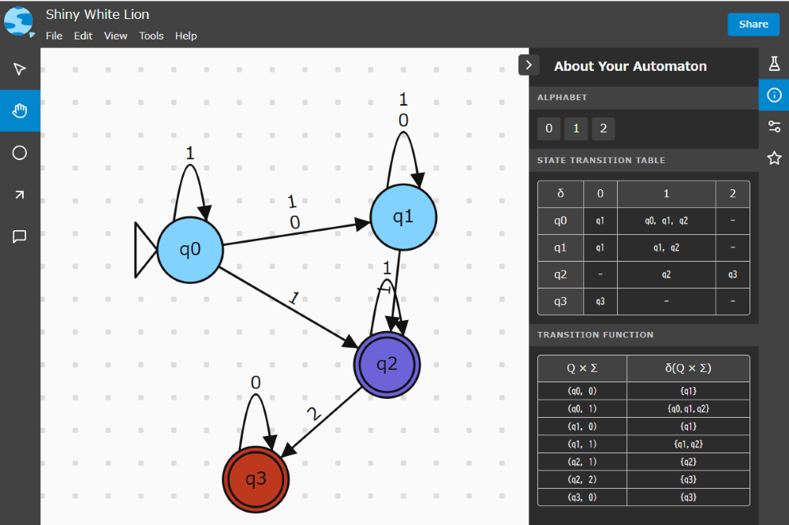

# ColAutomata
Colored Automata project
ColAutomata is an extended version of the [Automatarium](https://automatarium.tdib.xyz/) project, integrating the concept of colored final states to finite automata. This modification introduces a new project type: Non-deterministic Colored Finite Automaton (NCFA). The primary focus of ColAutomata is to provide tools for constructing and analyzing NCFAs, particularly for verifying and addressing mixedness in automata.

The GitHub source has not been made public due to security concerns. However, tutorial videos are available on [YouTube](https://youtu.be/5SLq0A5yiDI?si=ZBZbX2iQt5DTlASf)

## Key Features
1. Color Concept for Final States
In ColAutomata, each final state can be assigned a color. This allows the automaton to interpret inputs with greater precision. Colored states facilitate advanced analyses, such as identifying whether multiple states can accept the same input (mixedness).

2. Color Mix Check
The Color Mix Check button analyzes the NCFA created by the user to verify if any input is accepted by two or more differently colored final states.If such mixedness exists, it highlights the affected states.This ensures that the automaton's behavior remains deterministic and unambiguous in applications requiring distinct outputs for inputs.

3. εNFA to NFA Conversion
The εNFA to NFA button converts the εNCFA to an equivalent NCFA, ensuring clarity and simplifying further processing. This feature becomes accessible only after the Color Mix Check has been successfully executed.

4. Enhanced DFA Conversion
When converting to a DFA, newly created states that exhibit mixedness are clearly marked, providing the user with insight into potential ambiguities in the automaton.

## Contributors

Automatarium is built primarily by [RMIT University](https://www.rmit.edu.au/) students as a capstone project, created by the following students in 2022 (semester 1).

- [Max Reid](https://github.com/Prydeton)
- [Thomas Dib](https://github.com/tdib)
- [Ewan Breakey](https://github.com/giraugh)
- [Benji Grant](https://github.com/GRA0007)
- [Tim Tran](https://github.com/spacediscotqtt)

It has since been picked up and worked on by more capstone groups.
For a full list of contributors see: https://github.com/automatarium/automatarium/graphs/contributors

It has been modified and extended by [Munkh-Erdene Nyam-OChir/National Institute of Technology, Oshima College](https://www.oshima-k.ac.jp/) as student project.

## License

Automatarium is licensed under MIT
